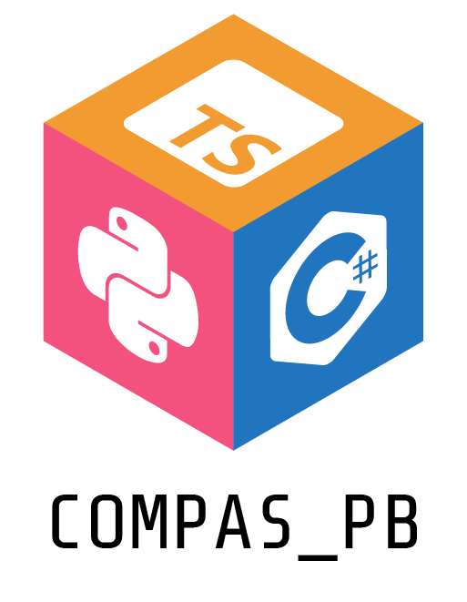

.. rst-class:: lead

A COMPAS extension which lets you serialize and deserialize COMPAS `Data` types using protobuf.

Installation
============

Stable releases can be installed from PyPI.

.. code-block:: bash

   pip install compas_pb

Basic Usage
===========

Serialize to file
-----------------

.. code-block:: python

   from compas.geometry import Vector
   from compas_pb import pb_dump
   from compas_pb import pb_load

   PATH = "vector.data"

   vector = Vector(1.0, 2.0, 3.0)

   pb_dump(vector, PATH)

   loaded_vector = pb_load(PATH)

(De)serialize to bytes
----------------------

.. code-block:: python

   from compas.geometry import Vector
   from compas_pb import pb_dump_bts
   from compas_pb import pb_load_bts

   vector = Vector(1.0, 2.0, 3.0)

   bytes_vector = pb_dump_bts(vector)

   loaded_vector = pb_load_bts(bytes_vector)

Serialization of arbitrarily nested data structures
----------------------------------------------------

.. code-block:: python

   from compas.geometry import Vector
   from compas.geometry import Polyline
   from compas_pb import pb_dump_bts
   from compas_pb import pb_load_bts

   data = {
       "direction": Vector(1.0, 2.0, 3.0),
       "outlines":
           [
               Polyline([0, 0, 0], [1, 1, 1], [2, 2, 2]),
               Polyline([3, 3, 3], [4, 4, 4], [5, 5, 5])
           ],
   }

   pb_data = pb_dump_bts(data)

   loaded_data = pb_load_bts(pb_data)

Table of Contents
=================

.. toctree::
   :maxdepth: 2
   :titlesonly:

   Introduction <self>
   installation
   missing_compas_type
   examples
   api
   protobuf
   license
